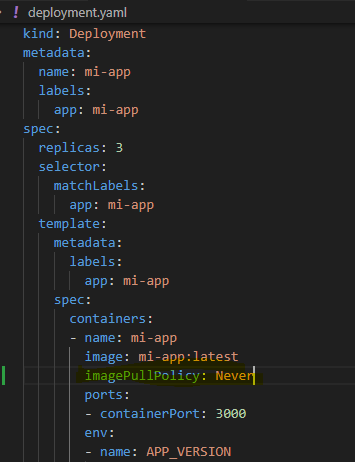
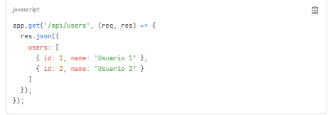
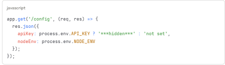

## Local Development Setup
* Instalar [Docker Desktop](https://www.docker.com/products/docker-desktop/)
* Instalar [Nodejs v16+](https://nodejs.org/id/blog/release/v16.16.0/) 
* Instalar [MiniKube ] (https://minikube.sigs.k8s.io/docs/start)

## Part I - Local Installation

* Habilitar Ingress ejecutando: > minikube addons enable ingress
* En una terminal separada habilitar Minikube Tunnel ejecutando: > minikube tunnel
* Clonar el siguiente repositorio: https://github.com/renatomartindc/lab-arquitectura-k8s.git
* Modificar el archivo /k8s/deployment.yaml y  adicionar la instruccion imagePullPolicy: 
* Ir a la carpeta /src/ y ejecutar: > npm install
* Construir imagen docker ejecutando: > docker build -t mi-app:latest .
* Carga imagen en MiniKube ejecutando: > minikube image load mi-app:latest
* Verificar imagen en Minikube ejecutando: > minikube image ls

* Desplegar en Kubernetes - MiniKube ejecutando: > kubectl apply -f k8s/
* Verificar Despliegue ejecutando: 
	** > kubectl get pods -l app=mi-app
	** > kubectl get services
	** > kubectl get ingress

* Ejecutar Dashboard MiniKube ejecutando: > minikube dashboard
* Verificar App funcionando con ingress y tunnel, ejecutando:
	** > curl http://127.0.0.1/
	** > curl http://127.0.0.1/health
	** > curl http://127.0.0.1/info

* Limpiar despliegue:
  ** kubectl delete -f k8s/

* Ejercicio 1: Adicionar nuevo endpoint , y redesplegar.
* Ejercicio 2: Escalar la aplicación, Adicionar replicas y ejecutar: kubectl apply -f k8s/deployment.yaml. Verificar pods ejecutando: kubectl get pods.
* Ejercicio 3: Configurar una nueva variable de entorno en el deployment.yml llamado API_KEY con valor: mi-api-key-secret y usar la variable en app.js  y redesplegar.
* Ejercicio 4: Eliminar un POD ejecutando: kubectl delete pod <pod_name>, observar la auto-recuperación y los logs ejecutando: kubectl logs -l app=mi-app -f

## Part II - CI/CD Installation

* Crear cuenta en DockerHub
* Crear acces token en DockerHub
* Crear secrets en GitHub
Hola mundo

